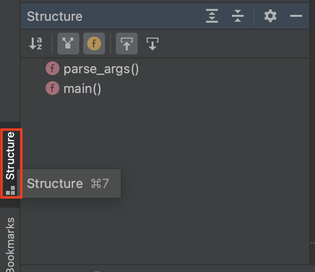
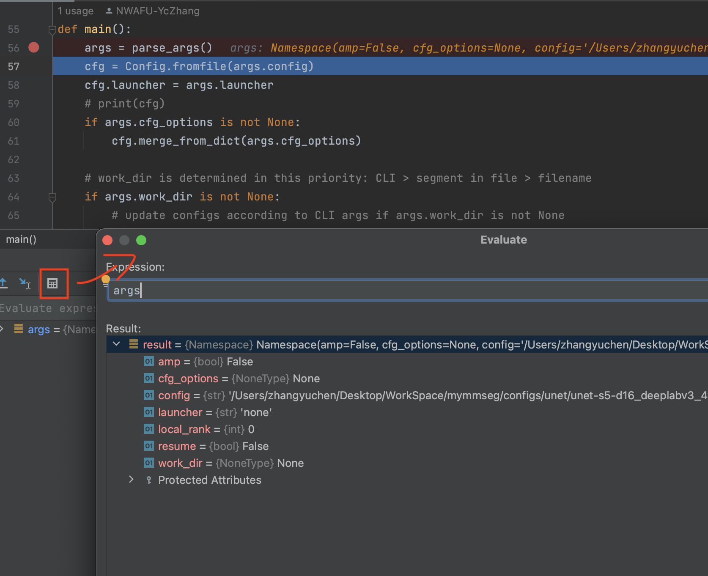
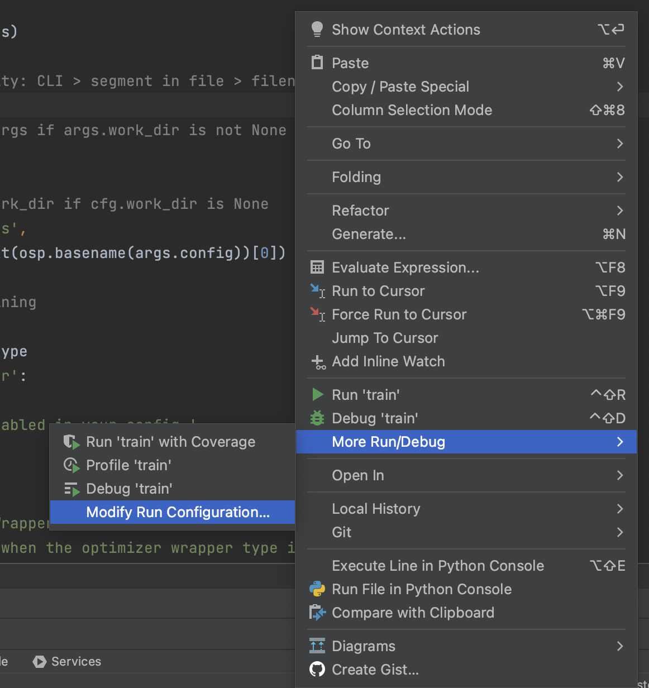
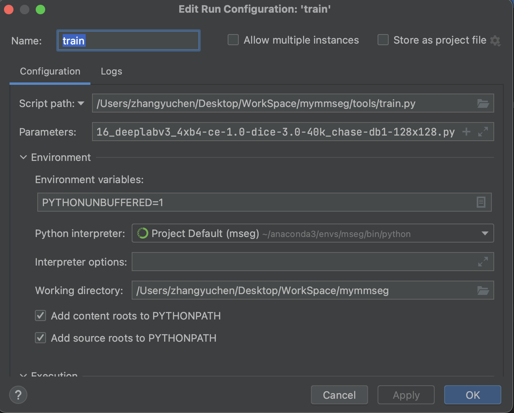

# <center>学习笔记</center>
## 一、Pycharm 使用

（一）、debug代码执行
首先 点击代码行号处，打断点，然后右键选择“debug **.py”即可开始
1. step over（上拐箭头）：执行代码行的下一步，不会进入子函数
2. step into（下箭头）：执行下一步，如果需要进入子函数，则跳转进去
3. step into my code（带标箭头）：与step into 作用相似，但是不会进入源码，即只会进入自己写的子函数
4. step out (上箭头)：跳出子函数，返回调用点

（二）、debug变量计算
1. 点击屏幕左下侧竖排按钮“structure”，会打开标签页，可以清晰的看到此文件中定义的变量、函数等数据

2. 点击Debugger 右侧 像计算器一样的小按钮“Evaluate Expression” 可以跳出标签页，方便进行变量计算


（三）、run config 
1. 右键选择modify run config，来配置运行python脚本时需要的参数，和脚本运行时的其他环境设置

2. run config中的配置如下图所示：

Parameters 是运行代码时需要加入的参数，Working directory是脚本运行时需要在的路径，比如要运行脚本时的指令为：
```python
python tools/train.py xxx --workdir xxx --sed xxxx
```
那么Parameters就设置成：xxx --workdir xxx --sed xxxx
Working directory 就设置成 path to tools‘s father dir(因为正确运行的命令是tools/train.py，所以要在tools的父目录执行这段代码，必须要这样做，因为很可能在脚本内部会对文件路径做文章，如果通过其他形式的路径运行代码，大概率会导致文件无法找到的错误)

## 二、mmcv----Registry
在mmcv中，最核心的两个机制就是config和registry，其中Config主要是提供各种格式的配置文件解析功能，而Registry用于提供全局类注册器功能。
Registry实现的核心是python中的 **装饰器** 用法，在内部维护了一个全局的字典。通过Registry类，用户可以通过字符串的方式实例化任何想要的模块。

python装饰器，字如其名，其实就是一个对类的“装饰”作用的语法操作，其实现形式是**闭包**，即函数的嵌套。
在外函数中定义一个内函数，内函数使用外函数的参数，在内函数中进行逻辑操作，外函数返回内函数。因为**在python中，万物皆是对象** 所以，函数也是对象，也可以被当作参数进行传递与返回，只不过函数可以通过()括号来调用而已。
而装饰器，就是对一个已经定义好的类，添加额外的操作，同时不需要进行类内的代码修改，python为装饰器提供了代码糖“@demo”的形式
```python
@MODELS.register_module()
class HRNet(BaseModule):
    """HRNet backbone.

    This backbone is the implementation of `High-Resolution Representations
    for Labeling Pixels and Regions <https://arxiv.org/abs/1904.04514>`_.

    """
    blocks_dict = {'BASIC': BasicBlock, 'BOTTLENECK': Bottleneck}

    def __init__(self,
                 extra,
                 in_channels=3,
                 conv_cfg=None,
                 norm_cfg=dict(type='BN', requires_grad=True),
                 norm_eval=False,
                 with_cp=False,
                 frozen_stages=-1,
                 zero_init_residual=False,
                 multiscale_output=True,
                 pretrained=None,
                 init_cfg=None):
        super().__init__(init_cfg)
        pass

```

在此样例代码中 ```@MODELS.register_module()```就是装饰器的语法糖，其实就是调用register_module()这个函数，将下面的HRNet这个类注册到model注册表中，只有在model注册表中注册的模型，才能被调用。
**值得注意的是**：注册器，在文件被import的时候，就会被调用了，即HRNet在HRNet.py文件中，当使用HRNet的文件import HRNet的时候，注册器就被调用了。

mmcv中的注册器简单实现代码如下：
```python
def register_module(module_name=None,force=False):
    def _register(cls):
        #cls即@下面紧跟的类，此例中为HRNet
        name = module_name
        # 如果传入了参数，则用此参数当作注册器中的名字
        if module_name is None:
            #没传入就用类名
            name = cls.__name__

        # 如果重名注册，则强制报错
        if not force and name in _module_dict:
            raise KeyError(f'{module_name} is already registered '
                           f'in {name}')
        # 一切正常，将此类（HRNet）与model_dict绑定，形成键值对，即完成模型注册
        _module_dict[name] = cls
        return cls

    return _register
```